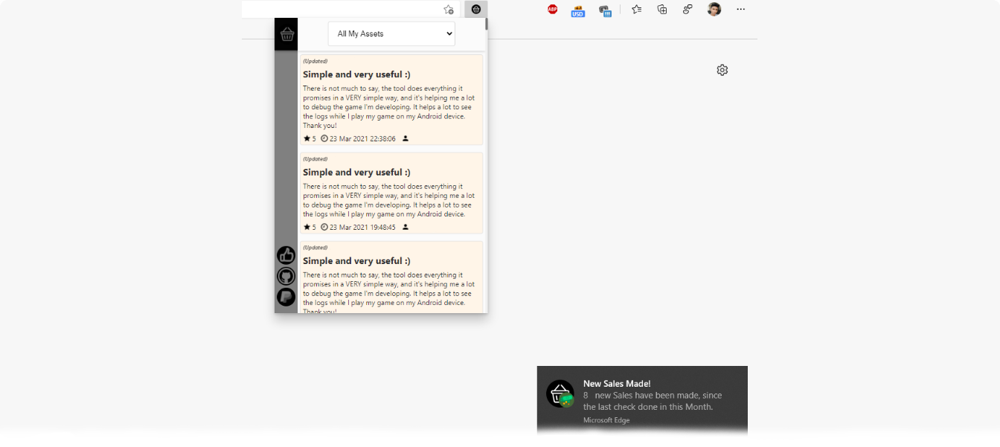

    
    Clone this repository and read the topics below to know how to use this Extension.

# How to use this extension?

To use this extension, from the code of this Repository, it is very simple. Just clone this repository by downloading it, then, in your Chromium browser, go to `chrome://extensions/` and then click on `Load Without Package` and then select the folder `Publisher-Tools-For-Asset-Store` of this repository.
 

    <b>For normal use it's recommended that you download this Extension from the Chrome Webstore.</b>

# Extension Features

This extension is intended for Publishers in the Asset Store and provides some tools for Publishers. This extension aims to provide some additional tools to the Publishers Portal, in order to complement it and not replace it, but to make life easier for the Editor. Some of the features currently available are...

- Reading of the latest Reviews Published or Updated by customers, from the Extension interface.
- New Sales Notifications
- New Refunds Notifications
- New Chargebacks Notifications
- New Reviews Notifications
- New Updated Reviews Notifications
- And more...

# Extension Compatibility

The extension is currently only compatible with `Chromium` based browsers and has been tested on the browsers below.

- Google Chrome
- Microsoft Edge Chromium

This extension, however, should work well on all other untested `Chromium` based browsers.
 
There are currently no plans to offer official compatibility with `Firefox`.

# Privacy/Security Notice

This extension does not collect any type of personal data from the user and neither stores nor sends them to other servers. The only data the Extension stores is your Reviews RSS URL and your Publisher ID. This data is used only to contact the Unity API and obtain your sales data.
 
 
The extension can only contact the API and Unity Servers, if your Browser is currently logged into the Unity Publisher Portal. The extension does not read any kind of Cookies or personal data, however, whenever it contacts Unity servers and its APIs, it just sends a Request to the servers and instructs your Browser to send session Cookies and other data needed, so when the servers return a response, the extension reads and interprets them.

# Support projects like this

If you liked this Extension and found it useful for your projects, please consider making a donation (if possible). This would make it even more possible for me to create and continue to maintain projects like this, but if you cannot make a donation, it is still a pleasure for you to use it! Thanks! 😀

 

    

 

Created with ❤ by Marcos Tomaz

